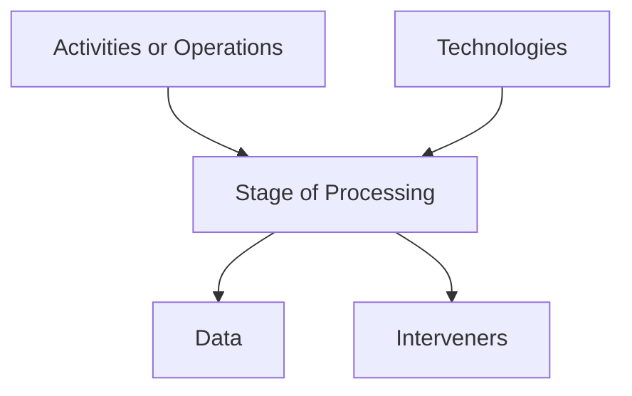

The purpose of the file structure and the verification form to provide a
basic guidelines to the requirements necessary for regulatory and
ethical compliance of experiments as well as to systematize the evidence
required for projects within a cascade funding activity such as
EUHubs4Data. The evidence summary at the end can be used as a project
management tool to e.g. approve execution or pay-out based on the
evidences collected.

| File structure of evidences |
|-----------------------------|

**Please provide links to archived documents for each item if
applicable**

**A.- Information on the participating entities and the roles they play
(data controller, data processor, data provider-consumer, etc. ....) in
relation to the overall purpose of the experiment**

**B.- Ethical and Regulatory Compliance (GDPR).**

**1. Ethical requirements**

**1.1. Experiment design**

Scientific documentation that provides relevant information for the
ethical and legal evaluation of the research.

**1.2. Data Management Plan**

Individual documentation on handling of all processed and/or published
data set according H2020 standards with particular reference to ethical
and GDPR aspects related to individual dataset and
processing/publication purposes

**1.3. Documents of approval by the Ethics Committee or Regulatory
Bodies**

Standardized and formal document that accredits the authorization of the
research.

**1.4. Document/letter/informed consent forms**

Standardized model applied in the experiment. It must necessarily have
been adapted to the specific conditions.

**1.5. Ethical Impact Assessment in Artificial Intelligence**

Application to Artificial Intelligence development of the Ethical
Guidelines for Reliable AI. The use of the ALTAI Model is recommended.
(<https://altai.insight-centre.org/>)

**2.- Evidences related to compliance with the General Data Protection
Regulation.**

**2.1. Data Flow and/or description**

It should include relevant information on data management: processing
activities and technology used, eventual data flows including data
categories, purposes, processing environments and parties involved.

**2.2. Determination and legal formalization of the relationship between
the parties**

- Data controller.
- Data processor.
- Joint controllers.
- Use and exploitation of data in anonymized environments (Data Sharing
Agreements).

**2.3. Risk analysis and data protection by design and by default**

Decisions and actions taken:

- Rights and security risk analysis.
- Data protection impact assessment.

Results of these decisions and, if processing has been carried out:

- Documentation of the conditions for implementing data protection by
design and by default.

**2.4. Security measures implemented**

**2.5. Anonymization or pseudonymization techniques used**

**2.6. Specific compliance with the right to transparency in data
protection**

**2.7. Record of processing activities**

Identification of the processing in the record of processing activities
of an entity.

Evidence or copies of the original evidence that can be exhibited for
the following purposes must be generated:

1.-Accreditation of compliance with ethical standards.

2.-Accreditation of compliance with data protection standards.

Inspection or supervision procedures at the request of:

- European Commission Bodies, reviewers etc..
- Audits.
- Supervisory bodies.
- Data Protection Authorities.

| Verification Form |
|-------------------|

**When completing this form, please note that there must be consistency
with the descriptive information that is referenced as documentary
evidence. You must archive a copy of the documentation (evidence
referring to each section). Do not forget that the ethics and privacy
compliance audit require mandatory submission of evidence.**

**1.Description of all involved entities and there roles and
responsibility towards the purpose**

The description of experiment submitted in the grant application is:

[ ] Appropriate

[ ] Must be reviewed and documented again

[ ] It has been revised and re-documented

It covers a data set use and data set creation: Yes [ ] No [ ]

**2.- Documents related to the experiment**

**2.1. Experiment Design**

Documentation related to the experiment design is:

[ ] Appropriate

[ ] Must be reviewed and documented again

[ ] It has been revised and re-documented

It has a retrospective phase and a prospective phase: Yes [ ] No [ ]

Do you have documentary evidence?

[ ] Yes [ ] No [ ] In process [ ] Does not apply

**2.2. Data Mangement plan**

The data management plan is:

[ ] Appropriate

[ ] Must be reviewed and documented again

[ ] It has been revised and re-documented

It has a retrospective phase and a prospective phase: Yes [ ] No [ ]

Do you have documentary evidence?

[ ] Yes [ ] No [ ] In process [ ] Does not apply

**2.3. Ethics Committee approval document**

Has the research been approved by the competent Ethics Committee?

[ ] Yes [ ] No [ ] In process [ ] Does not apply

**2.4. Document/letter/informed consent form**

Do you have an informed consent document?

[ ] Yes [ ] No [ ] In process [ ] Does not apply

**2.5. Ethical impact assessment in Artificial Intelligence**

Do you have a positive Artificial Intelligence ethical impact
assessment?

[ ] Yes [ ] No [ ] In process [ ] Does not apply

**3.- Evidences related to compliance with the General Data Protection
Regulation**

**3.1. Data Flow and/or description**

The description of the processes in your research pilot in the Project
submitted in the grant application is:

[ ] Appropriate

[ ] Must be reviewed and documented again

[ ] It has been revised and re-documented

It has a retrospective phase and a prospective phase: Yes [ ] No [ ]

**3.2. Determination and legal formalization of the relationship between
the parties**

Have you adequately identified the role you play in the processing of
the data under investigation?

[ ] Yes [ ] No [ ] In process [ ] Does not apply

Have you formalized any of the following contracts?

[ ] Data processor

[ ] Data controller

[ ] Data sharing agreement

[ ] Yes [ ] No [ ] In process [ ] Does not apply

Do you have documentary evidence?

[ ] Yes [ ] No [ ] In process [ ] Does not apply

**3.3. Risk analysis and data protection by design and by default**

According to the specific conditions of the processing, please indicate
whether you have done any of the following actions:

[ ] Rights risk analysis

[ ] Security risk analysis

[ ] Data protection impact assessment

[ ] Design of processing, applications, APPS, APIS applying data
protection by design and by default

[ ] Does not apply

Do you have documentary evidence?

[ ] Yes [ ] No [ ] In process [ ] Does not apply

**3.4. Security measures implemented**

If, according to your task, you are responsible for implementing
security measures in the processing, please indicate whether:

[ ] Based on a standard (please specify)

[ ] These are those specific to the National Security Scheme

[ ] These are measures specifically designed for the processing

Do you have documentary evidence?

[ ] Yes [ ] No [ ] In process [ ] Does not apply

**3.5. Anonymisation or pseudonymisation techniques used**

If you have applied pseudonymisation techniques, please indicate whether
they correspond to the requirements of the seventeenth additional
provision on the processing of health data of Organic Law 3/2018, of 5
December, on the Protection of Personal Data and Guarantee of Digital
Rights (LOPDGDD):

[ ] Technical and functional separation between the research team and
those performing the pseudonymisation and retaining the information
enabling re-identification

[ ] Express commitment to confidentiality and not to engage in any
re-identification activity

[ ] Specific security measures to prevent re-identification and access by
unauthorised third parties

[ ] Re-identification procedure when there is a real and concrete danger
to the safety or health of a person or group of persons, or a serious
threat to their rights, or it is necessary to ensure adequate health
care

[ ] Guarantees of the exercise of rights of access, rectification,
erasure, portability, limitation or opposition to processing, as well as
revocation of consent

Do you have documentary evidence?

[ ] Yes [ ] No [ ] In process [ ] Does not apply

Have you anonymised personal data?

Yes [ ] No [ ]

If yes, please indicate whether:

[ ] You have followed the recommendations of the data protection
authorities

[ ] You have carried out a risk analysis

[ ] You have used or combined more than one anonymisation technique

[ ] You have employed double-anonymisation strategies

[ ] You have subjected the finally anonymised data to some additional risk
verification

Do you have documentary evidence?

[ ] Yes [ ] No [ ] In process [ ] Does not apply

**3.6. Specific compliance with the principle of transparency in data
protection**

Indicate whether:

[ ] Fair, legitimate and lawful data processing is guaranteed

[ ] The duty of transparency in relation to the subjects of the study is
guaranteed

[ ] Does not apply

Do you have documentary evidence?

[ ] Yes [ ] No [ ] In process [ ] Does not apply

**3.7. Record of processing activities**

In case of processing of personal data, please indicate whether:

[ ] It is incorporated into a previously authorized processing operation
and recorded in the record of processing activities

[ ] It is a specific processing operation duly authorized and recorded in
the record of processing activities

[ ] Does not apply

Do you have documentary evidence?

[ ] Yes [ ] No [ ] In process [ ] Does not apply

| Evidence summary |
|------------------|

| **Section**                                                       | **Document**     |               |
|-------------------------------------------------------------------|------------------|---------------|
|                                                                   | Datasets created | Datasets used |
| 1.-Brief Description                                              | [ ]                | [ ]             |
| 2.- Ethical requirements                                          |                  |               |
| Datasets created                                                  | Datasets used    |               |
| 2.1 Detailed Experiment Design                                    | [ ]                | [ ]             |
| 2.2. Data Management Plan                                         |                  |               |
| [ ]                                                                 | [ ]                |               |
| 2.3 Ethics Committee Approval                                     |                  |               |
| [ ]                                                                 | [ ]                |               |
| 2.4 Informed consent                                              |                  |               |
| [ ]                                                                 | [ ]                |               |
| 2.5 AI impact assessment                                          |                  |               |
| [ ]                                                                 | [ ]                |               |
| 3.- GDPR evidences                                                |                  |               |
| Datasets created                                                  | Datasets used    |               |
| 3.1 Data Flow and/or description                                  | [ ]                | [ ]             |
| 3.2 Roles/relationship between parties                            |                  |               |
| [ ]                                                                 | [ ]                |               |
| 3.3 Risk analysis, DPIA, data protection by design and by default |                  |               |
| [ ]                                                                 | [ ]                |               |
| 3.4 Security measures                                             |                  |               |
| [ ]                                                                 | [ ]                |               |
| 3.5 Anonymisation or seudonymisation                              |                  |               |
| [ ]                                                                 | [ ]                |               |
| 3.6 Transparency                                                  |                  |               |
| [ ]                                                                 | [ ]                |               |
| 3.7 Record of processing activities                               |                  |               |
| [ ]                                                                 | [ ]                |               |
